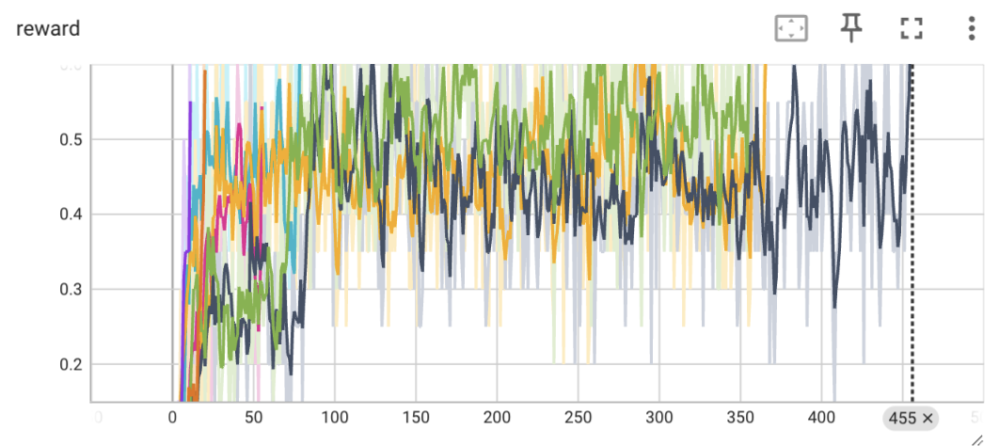
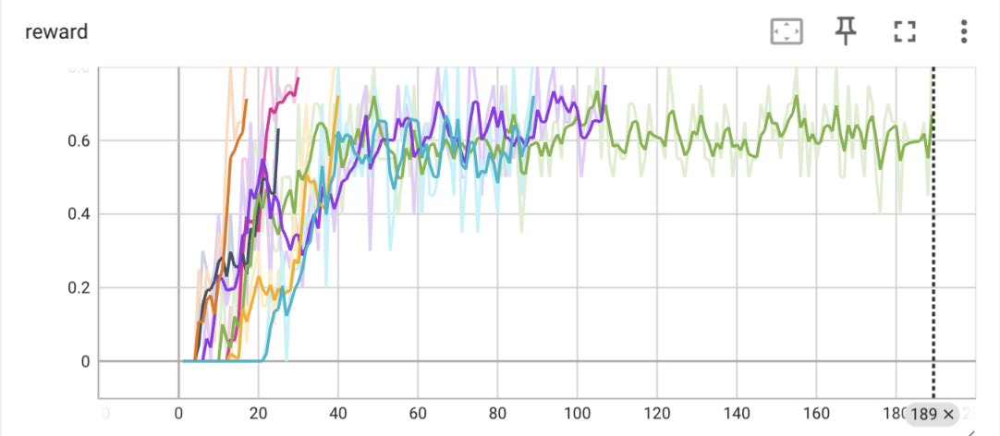
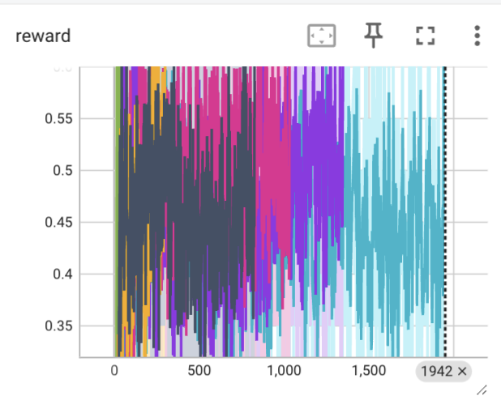
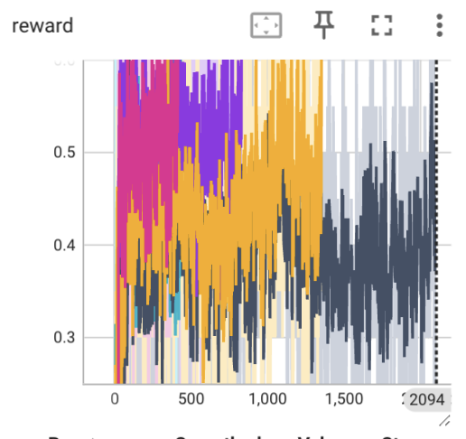
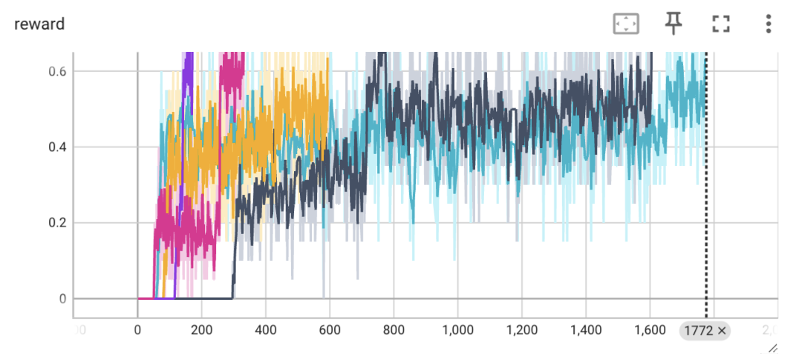
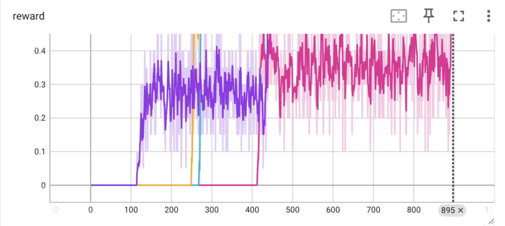

# Отчет 2. Исследование метода Q-learning в среде Frozen Lake 

## 1. Сравнение алгоритмов V и Q learning (2 балла)
Для алгоритма `V learning` на поле (4х4) при `gamma=0.9` сходимость (mean reward > 0.85)  достигается в среднем за 250 итерации (от 75 до 455). Графики зависимости reward от количества итераций приведены ниже.
Графики зависимости reward от количества итераций приведены ниже. 

Для алгоритма `Q learning` на поле (4х4) при gamma=0.9 сходимость (mean reward > 0.85) достигается в среднем за 100 итерации (от 16 до 189). Графики зависимости reward от количества итераций приведены ниже.
Графики зависимости reward от количества итераций приведены ниже. 

**Вывод:** Алгоритм обучения ценности состояний более эффективен чем обучение ценности действий. Это связано с тем, что алгоритм Q learning для каждоый последующей стратегии использует ранее накопленный опыт

## 2. Влияние гиперпараметра `GAMMA` на скорость сходимости . (2 балла)

Для алгоритма `Q learning` и  `V learning` на поле (4х4) при `gamma=0.8` сходимость (mean reward > 0.85) 
Графики зависимости reward от количества итераций приведены ниже. 
Q (от 400 до 1942)

V (от 400 до 2097)

**Вывод:** Увеличение гиперпараметра `GAMMA` приводит к увеличению сколичества эпизодов для сходимости. Это связано с тем, что при увеличении гамма увеличивается награда, снижается стоимость 1 действия или состояния

Уменьшение гиперпараметра `GAMMA` приводит к уменьшению сходимости  Это связано с тем, что, снижается стоимость 1 действия или состояния

## 3. Сравнение алгоритмов V и Q learning на поле большего размера (3 балла)
На Q сходимость наблюдается за 900 шагов (от 200 до 1772):

На V сходимость наблюдается в среднем за 400 (от 200 до 895) :

Сходимость v learning быстрее для данного примера, поскольку Q - learning сохраняет все возможные действия, v-learning - оринетируется на ценность нынешнего состояния
