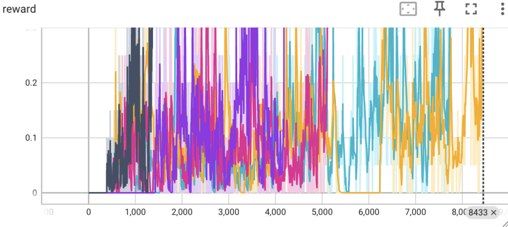
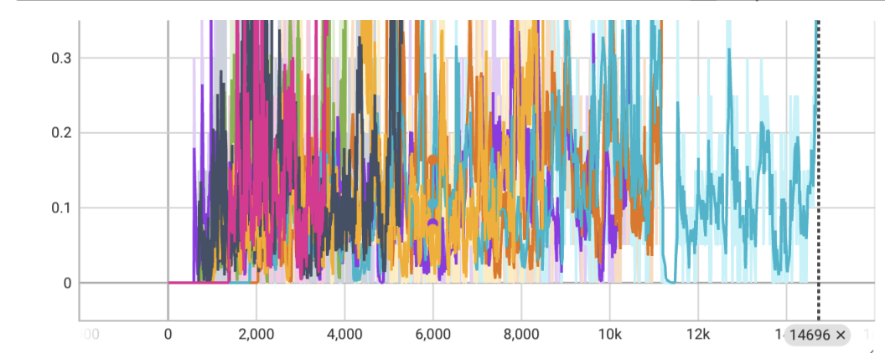
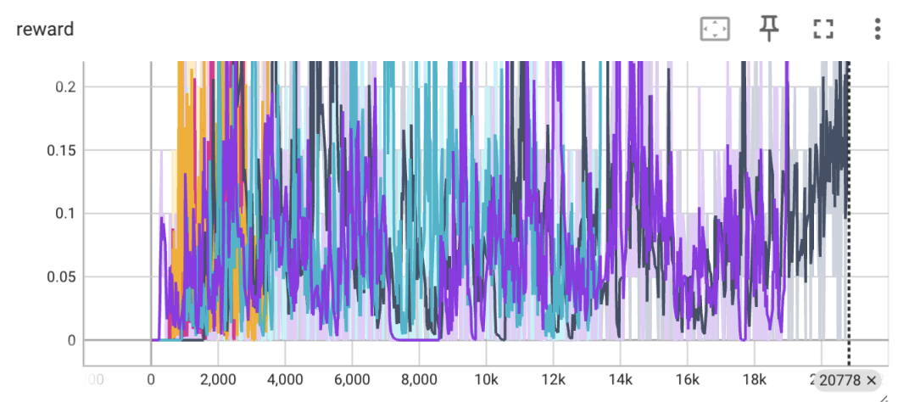
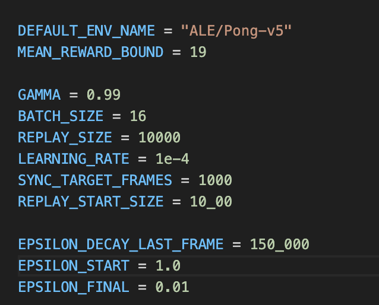
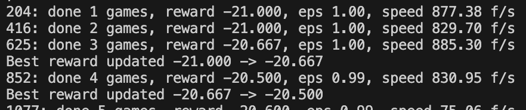
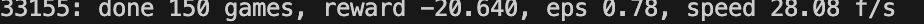
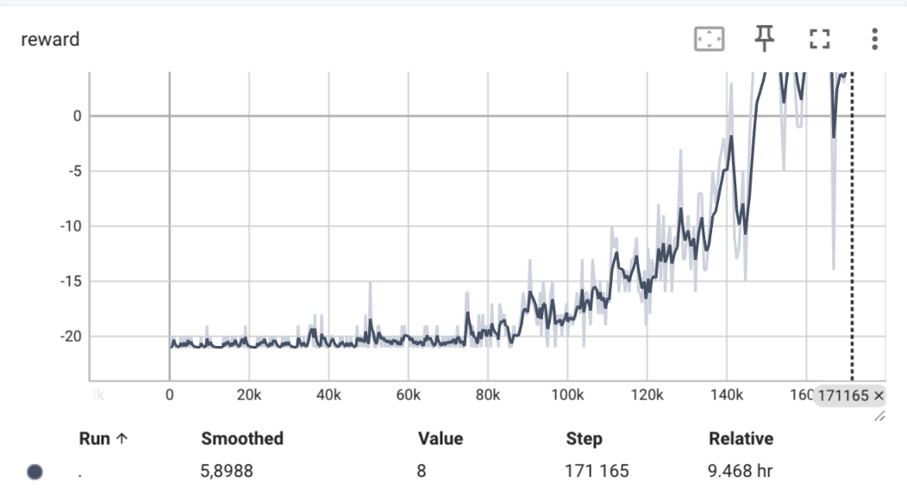
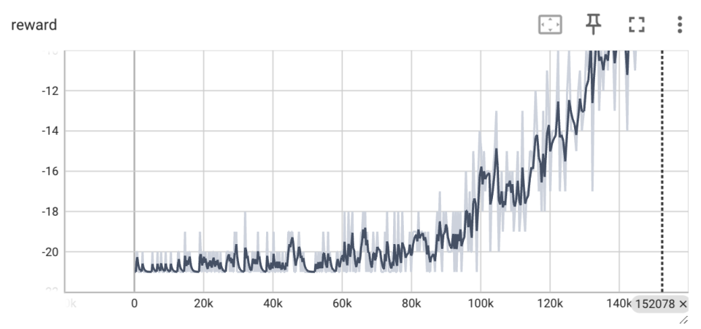
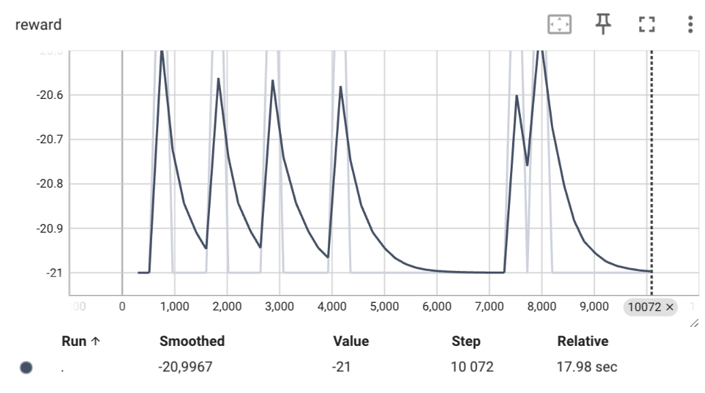

# Отчет 3. Deep Q-learning 

## 1. Изучение алгоритма табличного обучения (tabular Q learning) в среде Frozen Lake (2 балла)
Для алгоритма `Deep Q learning` на поле (4х4) при `alpha=0.7` сходимость достигается в среднем за 12133 итераций (от 7274 до 16992). 
Графики зависимости reward от количества итераций приведены ниже. 

Для алгоритма `Deep Q learning` на поле (4х4) при `alpha=0.5` сходимость достигается в среднем за 9567 итерации (от 3700 до 14696). 
Графики зависимости reward от количества итераций приведены ниже. 

Для алгоритма `Deep Q learning` на поле (4х4) при `alpha=0.9` сходимость достигается в среднем за 12000 итераций (от 3776 до 20766). 
Графики зависимости reward от количества итераций приведены ниже. 

При изменении 'alpha' в меньшую сторону приводит к увеличению скорости сходимости, при увеличении - у уменьшению.
'alpha' отвечает за "вес" нового значения. Отлимальное значение - 0.5 - ориентируемся на предыдущие и последующие значения

## 2. Изучение алгоритма глубокого обучения (Deep Q learning) в среде Pong. (2 балла)

Обучите сеть с гиперпараметрами по умолчанию и запишите видео.
При стандартных гиперпараметрах сеть обучалась примерно 7 часов, удалось обучить ее до выигрыша в -7. 

<video controls src="rl-video-episode-0.mp4" title="Title"></video>

При таких гиперпараметрах сеть обучалась значительно медленнее, несмотря на хороший старт: 

Оставаясь  через 150 игр на уровне -20.640 выигрыша 

## 3. Исследуйте влияние гиперпараметра (Deep Q learning в среде Pong, на Ваш выбор) на среднее количество шагов обучения. (3 балла)

<video controls src="rl-video-episode-0_2.mp4" title="1700000 шагов"></video>

При обычных параметрах модель обучилась за 1700000 шагов. Мне удалось обучить сеть до выигрыва в -7 за 7 часов (видео выше)

Далее модель начала давать показатели хуже, Однако в дальнейшем скорость обучения увеличилась. 

Для исследования выбран параметр`gamma`: 0,99 (как в предыдущем примере), 0,8  - доля вознаграждений от суммарного вознаграждения. 
При увеличении параметра обучение проиходит дольше, при уменьшении - быстрее. за 220 игр  вознаграждение достигло отметки -20.260 при значении `gamma` = 0.8

Однако при уменьшении `gamma` меньшего значения, например 0.01 обучение будет идти очень медленно. (для примера запускала обучение ненадолго для нескольких параметров, чтобы посмотреть старт обучения, но в целом направление движения обучения понятно)
 