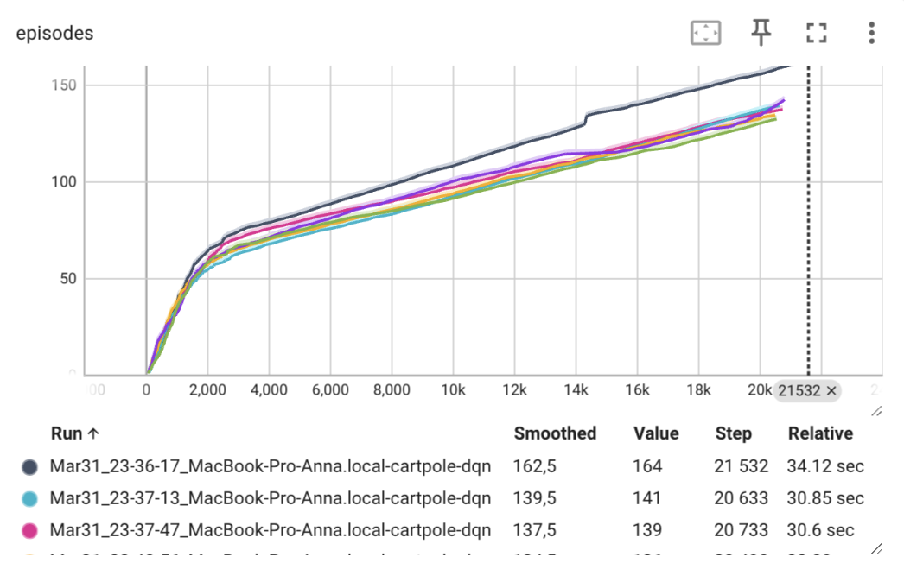
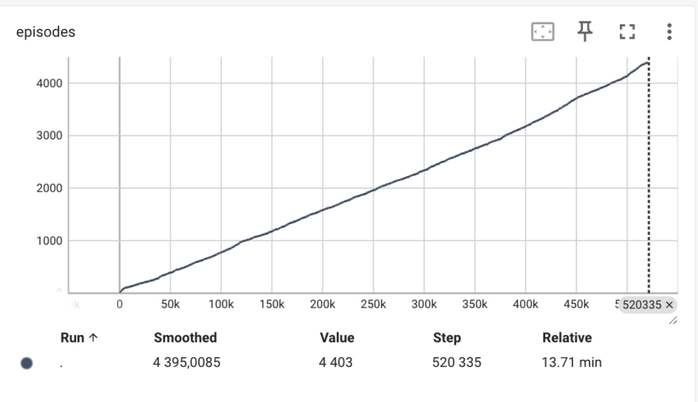
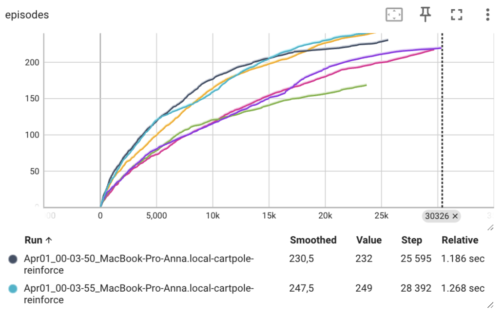
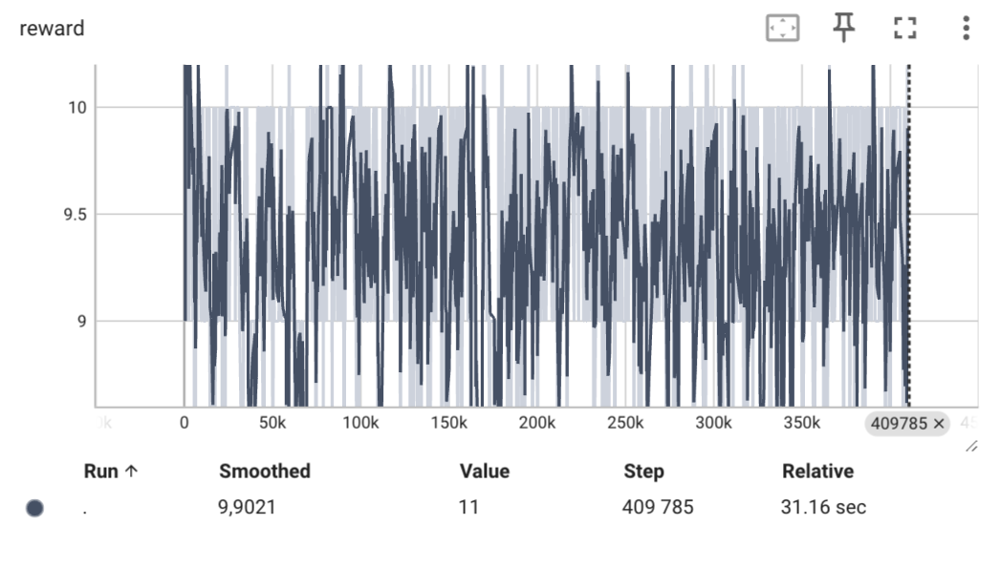
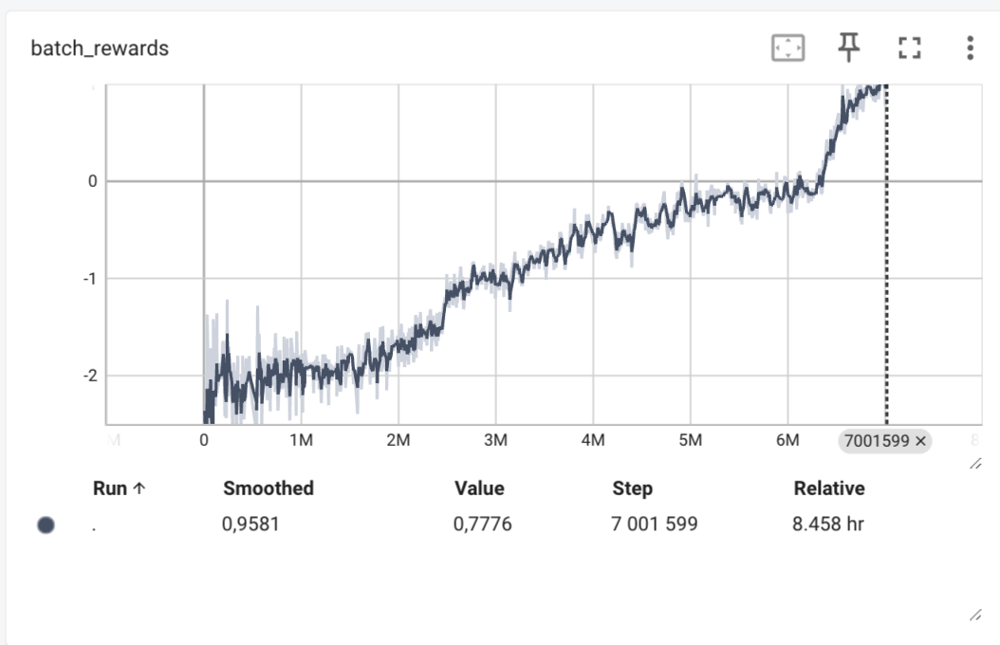

# Отчет 4. REINFORCE and Actor-Critic methods.

## 1. Изучение модификации алгоритма глубокого обучения (Deep Q learning) в среде Cartpole.

Для алгоритма `Deep Q learning` в среде cartpole при `GAMMA=0.99` сходимость достигается в среднем за 21000 итераций . 
Графики зависимости reward от количества итераций приведены ниже.

При уменьшении `GAMMA=0.8` обучение происходит в разы медленнее (алгоритм не сошелся даже за более чем 500000 итераций)

## 2. Изучение алгоритма REINFORCE. 

Для алгоритма `REINFORCE` при `GAMMA=0.99` сходимость достигается в среднем за  30000 итераций . 
Графики зависимости reward от количества итераций приведены ниже.

Для алгоритма `REINFORCE` при `GAMMA=0.8` сходимость не достигается даже за 400000 итераций. Значение выигрыша начинает расходиться, и агент не может найти оптимальную стратегию. 
Графики зависимости reward от количества итераций приведены ниже. (только 1 график)

При изменении параметра в меньшую сторону алгоритм увеличивает количество итераций.

При увеличении и уменьшении learning rate так же увеличивается количество итераций. 

Выбранные значения параметров являются оптимальными (локальный или глобальный минимум)

## 3. Изучение алгоритма Actor-Critic. 

Для алгоритма `Actor-Critic` при параметрах 
GAMMA = 0.99
LEARNING_RATE = 1e-3
ENTROPY_BETA = 0.01
BATCH_SIZE = 128
NUM_ENVS = 20

REWARD_STEPS = 4
CLIP_GRAD = 0.1 сходимость достигается более чем за 7000000 
Графики зависимости reward от количества итераций приведены ниже.

Для алгоритма `Actor-Critic` при  параметрах 
GAMMA = 0.1
LEARNING_RATE = 1e-3
ENTROPY_BETA = 0.01
BATCH_SIZE = 128
NUM_ENVS = 20

REWARD_STEPS = 4
CLIP_GRAD = 0.1 сходимость достигается более чем за . 

Графики зависимости reward от количества итераций приведены ниже.

При сравнении графиков (начало), ясно, что в начале обучения при параметре GAMMA = 0.1 обучение происходит медленнее. 

P.S. я ставила авто-критик с 0.8 на домашнем ноутбуке, но он перегрелся и выключился. В целом, изменение параметров давало отрицательный по сходимости результат. При увеличении LEARNING_RATE до 0.1, например, reward 100 первых итераций был на уровне -21.
